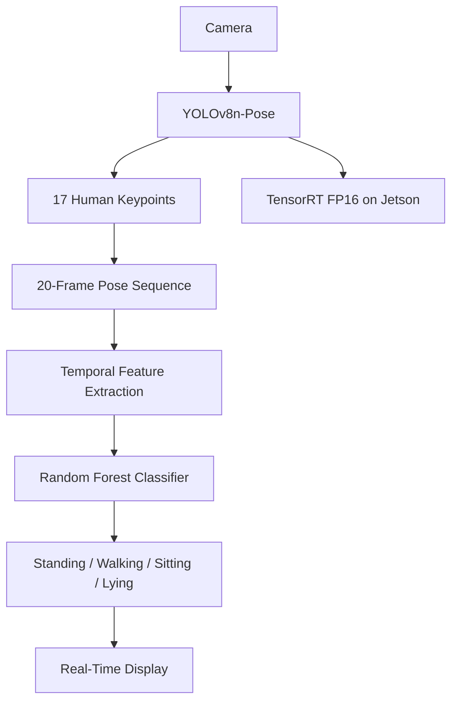

# Edge AI Human Activity Recognition

Real-time human activity and posture recognition using **YOLOv8n-Pose**, temporal pose features, a **Random Forest classifier**, and edge deployment on an **NVIDIA Jetson Orin Nano** with **TensorRT FP16 optimization**.

## Overview

This project recognizes four human activities/postures:

- **Standing**
- **Walking**
- **Sitting**
- **Lying**

The system first uses YOLOv8n-Pose to detect a person and extract 17 body keypoints. A short temporal sequence of poses is then converted into engineered motion and posture features and classified using a Random Forest model.

The complete pipeline was first developed and benchmarked on a laptop with an NVIDIA GeForce MX330, then deployed on an NVIDIA Jetson Orin Nano. The pose model was later optimized with TensorRT FP16 for faster edge inference.

> **Note:** The `lying` class represents a static lying posture. This project does not claim true fall-event detection.

## System Architecture



## Pipeline

```text
Camera
  ↓
YOLOv8n-Pose
  ↓
17 body keypoints
  ↓
Bounding-box normalization
  ↓
20-frame temporal sequence
  ↓
119 engineered pose features
  ↓
Random Forest
  ↓
Standing / Walking / Sitting / Lying
```

## Dataset

The dataset was collected manually using both a laptop webcam and the Jetson IMX219 CSI camera.

| Activity | Sequences |
|---|---:|
| Standing | 50 |
| Walking | 40 |
| Sitting | 50 |
| Lying | 40 |
| **Total** | **180** |

Each sequence contains:

- **20 pose samples**
- Sampling interval of approximately **0.1 s**
- About **2 seconds** of activity
- **17 COCO keypoints**
- `x`, `y`, and confidence for every keypoint
- **51 raw pose values per frame**

The person with the largest detected bounding box is selected when multiple people are visible.

## Pose Preprocessing

For every detected person:

1. YOLOv8n-Pose extracts 17 body keypoints.
2. Keypoint coordinates are normalized relative to the person's bounding box.
3. Low-confidence keypoints are replaced with zero coordinates while preserving their confidence value.
4. Twenty normalized poses are stored as one temporal sequence.

Bounding-box normalization reduces sensitivity to the person's position and distance from the camera.

## Feature Engineering

The Random Forest classifier does not directly use the raw `20 × 51` sequence.

For each of the 17 keypoints, the following seven temporal features are calculated:

- Mean x position
- Mean y position
- Standard deviation of x
- Standard deviation of y
- Mean absolute frame-to-frame x movement
- Mean absolute frame-to-frame y movement
- Mean confidence

This produces:

```text
17 keypoints × 7 features = 119 features
```

per activity sequence.

## Model Comparison

Two activity classifiers were tested.

### Random Forest

```text
Input: 119 engineered temporal pose features
Trees: 200
```

On the earlier 120-sequence model-selection dataset:

- Accuracy: **90.0%**
- Weighted F1-score: **0.89**

### LSTM

```text
Input: 20 × 51 pose sequence
Hidden size: 64
Output classes: 4
```

On the same earlier model-selection dataset:

- Accuracy: **73.3%**
- Weighted F1-score: **0.72**

The Random Forest was selected for the final pipeline because it performed better on the available small dataset while remaining lightweight and suitable for edge deployment.

The final deployed Random Forest was retrained after adding IMX219 samples and additional standing/sitting examples.

## Why Random Forest Instead of LSTM?

The project intentionally keeps the better-performing lightweight classifier rather than using a deep model only for complexity.

YOLOv8n-Pose already performs the deep-learning perception stage. The Random Forest then provides a fast second-stage temporal classifier.

```text
Deep Learning Pose Estimation
          +
Lightweight ML Activity Classification
          =
Efficient Edge AI Pipeline
```

## Real-Time Inference

During inference:

1. Camera frame is captured.
2. YOLOv8n-Pose detects the person and body keypoints.
3. Pose samples are added to a 20-frame temporal buffer.
4. Temporal features are calculated.
5. Random Forest predicts class probabilities.
6. Recent probability vectors are averaged for smoother predictions.
7. Activity, confidence, FPS, pose latency, and classifier latency are displayed.

## Hardware

### Laptop

- NVIDIA GeForce MX330
- CUDA-enabled PyTorch
- USB/internal webcam

### Edge Device

- NVIDIA Jetson Orin Nano 8GB
- JetPack / Jetson Linux R36.5.x
- CUDA 12.6
- IMX219 CSI camera
- NVIDIA Power Mode: **25W, Mode 1**

## Benchmark Results

The same overall activity-recognition pipeline was benchmarked on the laptop and Jetson.

| Device | Backend | Frames | Avg FPS | Avg Pose Latency | Avg Classifier Latency |
|---|---|---:|---:|---:|---:|
| NVIDIA GeForce MX330 | PyTorch CUDA | 1499 | **28.52** | **20.92 ms** | **14.58 ms** |
| Jetson Orin Nano | PyTorch CUDA | 1006 | **19.45** | **36.36 ms** | **20.33 ms** |
| Jetson Orin Nano | TensorRT FP16 | 1114 | **26.10** | **26.29 ms** | **21.83 ms** |

### TensorRT Improvement on Jetson

```text
Average FPS
19.45 → 26.10
≈ 34.2% improvement

YOLO pose latency
36.36 ms → 26.29 ms
≈ 27.7% reduction
```

The TensorRT optimization targets the YOLO pose-estimation stage. The Random Forest remains CPU-based, so its latency is not expected to improve from TensorRT.

## Jetson Resource Observation

During a representative real-time run in 25W Mode 1:

- RAM usage: approximately **3 GB**
- GPU temperature: approximately **59–60°C**
- Observed board power (`VDD_IN`): approximately **8.3 W** during active inference
- GPU utilization varied with the pose-inference workload and reached high utilization during active frames

The 25W setting is the configured power mode, not the continuous power consumption of the application.

## Project Structure

```text
Edge-AI-Human-Activity-Recognition/
├── data/
│   └── raw/
│       ├── standing/
│       ├── walking/
│       ├── sitting/
│       └── lying/
│   
├── models/
│   ├── yolov8n-pose.pt
│   ├── activity_classifier.joblib
│   ├── activity_lstm.pth
│   └── activity_labels.json
├── scripts/
│   ├── collect_data.py
│   ├── collect_data_jetson.py
│   ├── inspect_data.py
│   ├── pose_test.py
│   ├── train_model.py
│   ├── train_lstm.py
│   ├── benchmark.py
│   └── benchmark_jetson.py
├── benchmarks/
│   ├── laptop_mx330.csv
│   ├── jetson_orin_pytorch.csv
│   └── jetson_orin_tensorrt.csv
├── realtime_inference.py
├── realtime_inference_jetson.py
├── requirements.txt
├── .gitignore
├── LICENSE
└── README.md
```

> Generated TensorRT `.engine` files and downloaded YOLO weights should remain excluded from Git because they are large and/or hardware-specific.

## Installation

### Laptop

Create and activate a Python environment, then install the project dependencies:

```bash
pip install -r requirements.txt
```

Run the laptop real-time application:

```bash
python realtime_inference.py
```

## Jetson Orin Nano

The Jetson environment requires a JetPack-compatible CUDA-enabled PyTorch installation.

Do **not** replace the Jetson-specific PyTorch build with a generic CPU or incompatible pip build.

After activating the configured Jetson virtual environment:

```bash
python realtime_inference_jetson.py
```

The PyTorch and TensorRT benchmark CSV files are stored under:

```text
benchmarks/
```

## Training

Inspect the collected dataset:

```bash
python scripts/inspect_data.py
```

Train the Random Forest:

```bash
python scripts/train_model.py
```

Train the experimental LSTM:

```bash
python scripts/train_lstm.py
```

## Benchmarking

Laptop benchmark:

```bash
python scripts/benchmark.py
```

Jetson benchmark:

```bash
python scripts/benchmark_jetson.py
```

For Jetson system-level measurements, `tegrastats` can be run in a second terminal during inference.

## Key Engineering Findings

- A lightweight Random Forest outperformed the LSTM on the available small pose dataset.
- Camera-domain differences affected activity classification, so IMX219 samples were added to improve Jetson deployment behavior.
- The unoptimized Jetson PyTorch pipeline was slower than the MX330 laptop pipeline.
- TensorRT FP16 increased Jetson throughput by approximately **34%**.
- TensorRT reduced YOLO pose latency by approximately **28%**.
- A lightweight classical ML classifier can work effectively alongside a deep-learning pose estimator in an edge AI system.
- Benchmarking the complete pipeline is more useful than comparing only model inference speed.

## Limitations

- The dataset is relatively small and was collected by one user.
- Activity recognition depends on full-body visibility.
- Occlusion and unusual camera angles can reduce pose quality.
- Static lying posture is recognized, but true fall-event detection is not implemented.
- The Random Forest model is sensitive to Python/scikit-learn serialization compatibility across environments.
- TensorRT engines are generally generated for the target Jetson environment and should not be treated as portable model artifacts.

## Future Improvements

Possible future extensions include:

- Multi-person activity recognition
- Larger and more diverse training dataset
- True temporal fall-event detection
- Additional activities
- ONNX-based classifier portability
- Improved temporal smoothing
- Pose tracking across multiple people
- End-to-end edge deployment profiling

These are optional extensions; the current project already demonstrates the complete edge AI workflow from data collection to TensorRT deployment.

## Skills Demonstrated

- Computer Vision
- Human Pose Estimation
- YOLOv8
- Temporal Feature Engineering
- Random Forest Classification
- LSTM Experimentation
- PyTorch
- CUDA
- TensorRT
- Edge AI
- NVIDIA Jetson Orin Nano
- OpenCV
- GStreamer
- Real-Time Inference
- Performance Benchmarking
- Model Deployment

## Project Summary

This project demonstrates an end-to-end Edge AI workflow:

```text
Data Collection
      ↓
Pose Estimation
      ↓
Feature Engineering
      ↓
Model Comparison
      ↓
Real-Time Inference
      ↓
Jetson Deployment
      ↓
TensorRT Optimization
      ↓
Performance Benchmarking
```

The final system runs real-time human activity/posture recognition on the NVIDIA Jetson Orin Nano and demonstrates a measurable performance improvement after TensorRT optimization.

## License

This project is released under the **MIT License**. See the `LICENSE` file for details.
